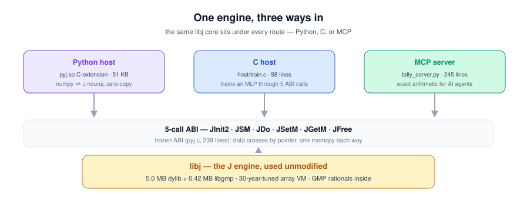
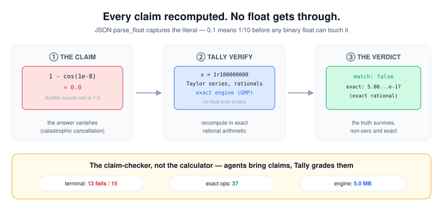
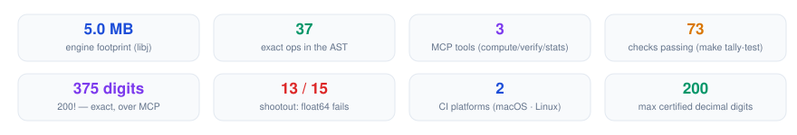

# pyj

[](https://github.com/shiaho777/pyj-j/actions/workflows/tests.yml)
[](LICENSE)


A few-megabyte **embeddable tensor kernel**: the J language engine, loaded
in-process, used unmodified as the compute core — with reverse-mode autodiff,
a tape compiler, and an MLIR export path living inside it. Python is the
host; the kernel ships like SQLite, not like a language you write in.

The bet in one line: a closed-set array language is a ready-made IR with a
30-year-tuned interpreter attached, and that combination is more useful
*embedded* than it ever was as a language. The full argument — the niche,
the invariants, the success criteria — is in [VISION.md](VISION.md).

<p align="center"></p>

Concretely: numpy arrays cross into J without conversion, and the bridge
layers reverse-mode AD on top — tape recording, VJP rules, and a compiler
that fuses a whole model into a single J verb.

```python
import pyj, numpy as np

pyj.set("a", np.array([1.0, 2.0, 3.0, 4.0]))
pyj.do("s=: +/ a")            # J sentence, executed by the engine
pyj.get("s")                  # -> 10.0, numpy float64

pyj.set("m", np.arange(24.0).reshape(2, 3, 4))
pyj.do('t=: +/"1 m')          # rank-1 sum: vmap for free
pyj.get("t")                  # shape (2, 3)

pyj.do("bpv=: !32x")          # 32! exactly, via GMP — past int64
```

## Tally: exact arithmetic for AI agents

Same engine, second face. **Tally** is an MCP server ([TALLY.md](TALLY.md))
that gives AI agents exact arithmetic — integers, rationals, matrices,
statistics — with no float error, ever. Agents never see J; they call three
tools (`tally_compute` / `tally_verify` / `tally_stats`) and every result is
an exact integer or `p/q` rational. JSON is parsed with `parse_float`
capturing the literal text, so `0.1` means 1/10 before any float can touch it.

<p align="center"></p>

Why it matters — a sample from the [caught-in-the-act cards](recon/CARDS.md):

**The formula LLMs generate most often for variance:**

| | answer |
|---|---|
| numpy one-pass `mean(x²)−mean(x)²`, x = 1e9+0..9 | `128.0` |
| **Tally** | `33/4` (exactly 8.25) |

**The branch that matters:**

| | answer |
|---|---|
| python: `0.1` added 10 times `== 1.0` | `False` (0.9999999999999999) |
| **Tally** | exactly `1` — the reconciliation job takes the right branch |

**The answer that vanishes:**

| | answer |
|---|---|
| python: `1 - math.cos(1e-8)` | `0.0` (rounded to exactly zero) |
| **Tally** | ≈ 5.00000000000000042×10⁻¹⁷, exact rational |

10 more cards: [recon/CARDS.md](recon/CARDS.md). The 15-point shootout with
methodology and honest boundaries: [recon/REPORT.md](recon/REPORT.md). Run
the money-checker demo over a real MCP handshake: `make demo`. Full test
suite (73 checks): `make tally-test`.

<p align="center"></p>

<p align="center"></p>

<p align="center"></p>

## Autodiff

`ad.ijs` is ~360 lines of J implementing reverse-mode AD over a closed set of
24 primitives (arithmetic, matmul, tanh/exp/log, sum/max, rank-1 ops,
reshape/transpose/take/drop/gather). `adt.py` wraps it in a tensor API:

```python
from adt import Graph
g = Graph()
X = g.tensor(Xa, "X")
W = g.tensor(Wa, "W")
L = (((X @ W).tanh() - Y) ** 2).sum()
g.back(L)
W.grad                        # numpy array — computed by J
```

Every forward pass and every gradient in the loop below executes in the J
engine, not numpy:

```python
for step in range(600):
    W1.value = w1; W2.value = w2
    g._sync_leaves()
    L = build_loss(g)         # e.g. log-sum-exp cross-entropy
    g.back(L)
    w1 = w1 + lr * W1.grad
```

The test suites include central-difference gradchecks (matmul, MLP with bias,
softmax, cross-entropy, embedding lookup with duplicate indices) and training
runs — logistic regression, a 2-layer MLP, a 3-class softmax classifier, an
embedding model — each converging to accuracy 1.00.

## The tape compiler

Interpreting the tape means a boxed walk per backward pass: `select.`
dispatch and row lookups for every node. `adcomp.ijs` instead reads the tape
and emits the source of one explicit J verb — straight-line forward code, then
straight-line VJP code, the way you would have written it by hand. Constants
bake in at compile time; dead subgraphs get pruned.

Measured on a 96-sample softmax forward+backward:

| | per step |
|---|---|
| rebuild tape + ADGET | 4.05 ms |
| compiled verb | 0.02 ms |

That's ~200× (4.05 ms → 0.02 ms), and it's the path I'd take further: the generated verb is
ordinary J, so it can eventually be replayed, cached, or shipped to a real
backend.

$$
\frac{\text{rebuild tape + ADGET}}{\text{compiled verb}} = \frac{4.05\ \text{ms}}{0.02\ \text{ms}} \approx 200\times
$$

## The bridge

Data crosses by pointer, not by format. Writing is `JSetM` (`io.c` `setterm`):
one `memcpy` from the numpy buffer into JE memory. Reading is `JGetM`: J
hands back raw shape/data pointers into JE memory, and one `memcpy` fills a
fresh numpy array. Types map 1:1 at 64 bits — bool/int64/float64/complex128
to B01/INT/FL/CMPX. On a 10M-element sum, 8 ms goes to crossing the bridge
(~10 GB/s) and 1 ms to the engine.

## Building

You need a J engine runtime (libj + profile.ijs), GMP, and Python with numpy.

```sh
git clone https://github.com/jsoftware/jsource   # or copy bin/ from a J release
cd jsource/make2 && ./build_libj.sh && ./build_jconsole.sh && ./cpbin.sh
cp ../jlibrary/bin/* <this repo>/jlibrary/bin/   # libj, profile.ijs

brew install gmp    # macOS; JE dlopens libgmp at startup
./build.sh
```

Then:

```sh
DYLD_LIBRARY_PATH=$PWD/jlibrary/bin PYJ_LIBPATH=$PWD/jlibrary/bin python3 test_pyj.py
```

`test_pyj.py` (bridge), `test_ad.py` (AD core), `test_nn.py` (tensor API),
`test_ops2.py` (rank-1/softmax), `test_ops3.py` (take/drop/gather + compiler
parity + embedding training), `test_ops4.py` (arbitrary-axis sum + 3D
softmax), `test_ops5.py` (gates + tape replay + compiled replay),
`test_mlir.py` (MLIR export/execute parity),
`test_train2.py` (softmax classifier),
`test_compile.py` (compiler validation + benchmark).

Tested on macOS arm64. Linux should work with the `.so` suffix (the build
script handles it) but hasn't been verified on a clean machine yet.

## Notes from the trenches

Things I learned building this on J 9.8 beta, kept here because they'll bite
again:

- Top-level control words are rejected in embedded mode — everything lives in
  explicit `3 : 0` verbs. The stdlib isn't loaded either, so `empty` and `LF`
  don't exist.
- Boolean literals auto-type to B01. Node id lists must be forced to INT with
  `(2#0)+x,y` or `{` indexing breaks.
- `+/` reduces the **leading** axis — that's numpy's `sum(axis=0)`, not the
  last axis.
- After `JInit2`/`JSM`, one warmup `JSetM` is required before name lookup
  works; without it, later `JDo`/`JGetM` fail silently.
- `}` amend *replaces*, never accumulates. Embedding gradients (duplicate
  indices) need an `(i.n)="(0 1) idx` boolean-table matmul instead.
- `(N,1) * (1,1)` is a length error: J extends rank-0 scalars, but doesn't
  extend length-1 frames the way numpy broadcasts.
- `shape $ array` keeps the *item shape* of the argument: `(2,3,4) $ (8,3)`
  is `(2,3,4,3)`, not `(2,3,4)`. Ravel first (`$ ,y`) when you want pure
  element cycling. This one silently changed gradient shapes in the middle
  of a backprop pass.

## Roadmap

Phase 1 — build the machine (done):

- [x] Zero-copy numpy bridge
- [x] Closed-set reverse-mode AD, gradchecked
- [x] Tensor API, end-to-end training runs
- [x] Tape-to-verb compiler (~200× vs the interpreted tape)
- [x] take/drop/gather (embedding lookup); arbitrary-axis sum; compare
      gates + gated mix; tape replay caching (0.03 ms/step compiled loop)
- [x] MLIR export: tape → func/arith/linalg/tensor → LLVM → native
      execution, bit-matching the J engine's forward

Phase 2 — harden the kernel (next):

- [x] Linux CI + build (macOS arm64 + ubuntu-24.04, clean checkout)
- [x] Exporter coverage: take/drop/gather/reshape/transpose
- [x] Thread-safety audit of the bridge (single J instance today)
- [x] Kernel ABI freeze: document the pyj C surface as a stable contract

Phase 3 — prove the niche:

- [x] One real, non-demo workload running its numerics through the kernel:
      `host/train.c`, a ~100-line C host with no Python and no BLAS, drives
      libj through the raw ABI to train a 2-16-16-2 tanh MLP on two-spiral
      to 100% train accuracy (seeded, deterministic, runs in CI on both
      platforms). Every numeric step -- dataset, forward, backprop, SGD --
      executes inside the J engine; the host only sequences the ABI and
      reads one scalar back.
- [x] Ship story: `vendor/` is what a downstream app receives — the
      prebuilt engine (~5 MB), two pure-J kernel scripts, and a ~100-line
      C app that trains in-process and serves predictions. No jsource, no
      Python, no engine build step: `make && ./vendor_demo`.

Phase 4 — exact arithmetic as an agent tool (in progress):

- [x] Tally MCP server (`tally_server.py` + `tally_ast.py`): three tools —
      `tally_compute`, `tally_verify`, `tally_stats`. Every result is an
      exact integer or `p/q` rational; floats never enter the engine.
- [x] `tally_verify` audit notes: on a mismatch it reports where the claim
      went wrong (wrong magnitude / wrong digit #N / wrong sign), not just
      that it mismatched.
- [x] Evidence pack (`recon/`): a 15-point shootout vs terminal defaults
      (float64, bc, numpy) and 13 caught-in-the-act cards for the README.
- [x] Repo entry points: `make tally-test` (73 checks), `make demo`,
      `make shootout`, `make cards`, `make host`, `make vendor`.

## Embedding it yourself

Three levels, same engine:

1. **Python host** (`pyj` module + `adt.py`): numpy arrays cross the
   bridge zero-copy; `ad.ijs` does tape AD; `adcomp.ijs` compiles the
   tape to straight-line J verbs; `adexport.py` emits MLIR.
2. **C host** (`host/train.c`): the raw 5-call ABI — `JInit2`, `JSM`,
   `JDo`, `JGetM`, `JFree`. Trains a classifier end-to-end in J.
3. **Vendored** (`vendor/`): prebuilt `libj` + kernel scripts + demo
   app. The zero-build downstream experience.

## License

GPL-3.0 — see [LICENSE](LICENSE). The embedded J engine is Jsoftware's
jsource, used at runtime under the same license; nothing from it is
redistributed here. Not affiliated with Jsoftware.
