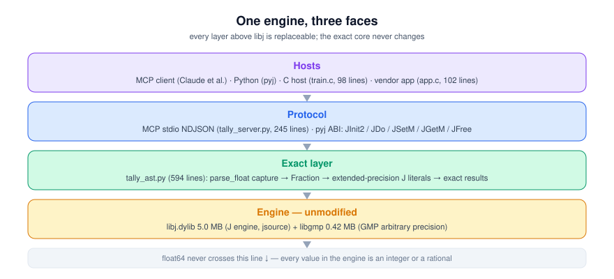
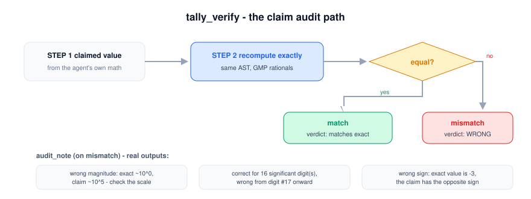

# Tally — the exact-compute engine for AI agents

[](https://github.com/shiaho777/pyj-j/actions/workflows/tests.yml)
[](LICENSE)


Tally is an MCP server that gives AI agents **exact arithmetic**: integers,
rationals, matrices, and statistics with *no float error, ever*. It runs on
the embedded J engine (`libj`, ~5 MB, GMP-backed), but agents never see J —
they talk to three tools over MCP.

Named after J's `#` verb (*tally*). The language is invisible; the exactness
is the product.

<p align="center"></p>

## Why

Floats are the enemy. `0.1 + 0.2 ≠ 0.3` in every float64 tool your agent
already has. `mean(x²) − mean(x)²` — the formula LLMs most often generate for
variance — returns **128.0** on `[1e9 … 1e9+9]` where the truth is **8.25**
(catastrophic cancellation; see `recon/REPORT.md`). `1 − cos(1e-8)` returns
exactly `0.0`. When a number must be *right* — money, rates, matrix results,
combinatorics — floats are not acceptable, and neither is trusting the
model's own arithmetic.

Tally's contract:

- **Every result is exact.** Integers stay integers; decimals and `"p/q"`
  strings become exact rationals. `0.1` means 1/10 — JSON is parsed with
  `parse_float` capturing the literal text, so no binary float ever enters.
- **Decimals are truncated, never rounded** — a stated-precision number is a
  *floor*, which is what an auditor wants.
- **verify before you trust.** `tally_verify` recomputes any expression
  exactly and grades a claimed value, reporting the exact truth plus
  absolute/relative error on mismatch.

<p align="center"></p>

<p align="center"></p>

## Tools

| tool | purpose |
|---|---|
| `tally_compute` | evaluate an exact-arithmetic AST |
| `tally_verify` | recompute exactly; grade a claimed value (truth + errors) |
| `tally_stats` | exact mean/var/stddev/min/max/sum/count over a dataset |

### AST (v0)

- **numbers**: `42` · `true` · `"0.1"` · `"22/7"` · `"1e-8"` · JSON numbers.
  All parsed exactly — `0.1` means 1/10, never a float.
- **arrays**: nested rectangular lists, e.g. `[[1,2],[3,4]]`
- **ops** `{"op": NAME, ...}`:
  - arithmetic: `add sub mul div` (`args[]`, n-ary) · `neg abs sign floor ceil`
    (`arg`) · `pow` (`base`, `exp` — integer exponent) · `factorial` ·
    `comb`/`perm` (`n`,`k`) · `gcd`/`lcm` (`args[]`) · `mod` (`a`,`b`)
  - `sqrt` / `exp` (`arg`, `digits?` ≤ 200) — certified rational convergents
  - comparisons: `eq ne lt le gt ge` (`a`,`b`) → exact boolean
  - aggregates: `sum prod min max` (`args[]` or `of`) · `mean var stddev` (`of`)
  - linear algebra: `matmul`/`dot` (`a`,`b`) · `det`/`inv`/`transpose` (`m`) ·
    `solve` (`a`,`b`) — exact rational linear algebra (Hilbert₄ inverse is
    exactly integer)

### Examples

```jsonc
// mortgage balance after 360 payments, monthly rate 0.416666...%
{"op":"mul","args":["100000",
  {"op":"pow","base":"1.00416666666666666666666666666667","exp":360}]}
// -> exact rational + decimal + float64 shadow

// check a claimed variance before trusting it
tally_verify {
  "expression": {"op":"var","of":[1e9+0 … 1e9+9 as strings]},
  "claimed": "128" }
// -> {"match": false, "exact": "33/4", "first_mismatch": {...}}
```

The variance case in numbers:

$$
\operatorname{var}(x) = \frac{1}{n}\sum (x_i - \bar{x})^2, \qquad x = [10^9, 10^9{+}1, \dots, 10^9{+}9]
$$

$$
\text{one-pass float64: } 128.0 \qquad\qquad \text{Tally (exact): } \frac{33}{4} = 8.25
$$

The one-pass formula cancels catastrophically because $10^9$ and $10^9 + 9$
are indistinguishable from their squares' lower bits in float64. Tally keeps
every value rational, so nothing cancels.

## Run

```sh
# the server is stdio-only; MCP hosts spawn it as a subprocess
DYLD_LIBRARY_PATH=jlibrary/bin PYJ_LIBPATH=jlibrary/bin \
    python3 tally_server.py          # macOS
LD_LIBRARY_PATH=jlibrary/bin   PYJ_LIBPATH=jlibrary/bin \
    python3 tally_server.py          # Linux
```

Claude Desktop / MCP host config:

```json
{"mcpServers": {"tally": {
  "command": "/usr/bin/env",
  "args": ["python3", "/path/to/pyj/tally_server.py"],
  "env": {"PYJ_LIBPATH": "/path/to/pyj/jlibrary/bin",
          "DYLD_LIBRARY_PATH": "/path/to/pyj/jlibrary/bin"}}}}
```

Any message on stdout that is not a protocol message would corrupt the
stream, so logging goes to stderr only.

## Demo

```sh
DYLD_LIBRARY_PATH=jlibrary/bin PYJ_LIBPATH=jlibrary/bin python3 demo_tally.py
```

Runs the money-checker story end-to-end over a real MCP handshake: an agent
computes a mortgage balance with float64, Tally flags it wrong, and the exact
rational result is returned.

## Tests

```sh
DYLD_LIBRARY_PATH=jlibrary/bin PYJ_LIBPATH=jlibrary/bin python3 test_tally.py
```

73 tests: every op, exactness contracts from `recon/REPORT.md`, edge/error
handling, and a real MCP stdio handshake (NDJSON framing, unknown-method and
tool-error paths, 200! across the wire).

## v0 limits (honest ones)

- `pow` needs an integer exponent (use `sqrt`/`exp` for fractional powers);
  `exp`/`sqrt` return certified rational convergents, not transcendental
  results (impossible by definition — that's the point).
- No complex numbers, no symbolic algebra, no strings of `sin/cos/log` yet.
- One J engine per process, single-threaded — same contract as the pyj ABI.
- Per-call limits (2000 AST nodes, 20k array elements, 200 digits, 200!
  still fine) are guardrails, not the roadmap.

## License

GPL-3.0 (same as the pyj project). The embedded J engine is Jsoftware's
jsource, used at runtime under the same license; nothing from it is
redistributed here.
