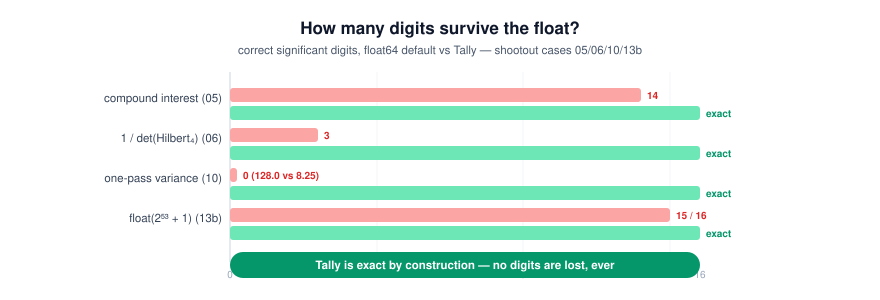

# shootout 对拍战报:终端默认姿势 vs 精算引擎

<p align="center"></p>

日期:2026-09-07 · 平台:macOS arm64 · 引擎:libj 9.8.0-beta7 + GMP
方法:每科目前半栏是 agent 在终端里的**默认姿势**(python3 内建 float /
bc 默认 / numpy float64),后半栏是同一个量经 pyj 桥由引擎以 GMP 精确
整数/有理数算出的结果。15 个比分点,1 道(第 12)是刻意安排的对照组。

| # | 科目 | 终端默认姿势 | 精算引擎 | 判定 |
|---|---|---|---|---|
| 01 | bc: 1/3(默认 scale) | `0` | `1/3 = 0.333…`(30 位截断) | **终端阵亡** —— scale=0 静默截断,模型原样引用就把 0 传播下去 |
| 02 | bc: sqrt(2) | `1` | `1.414213562373095048801688724209`(30 位截断) | **终端阵亡**——bc 不带 -l 时 sqrt(2)=1;引擎给出 Newton 有理逼近,且满足 n²−2d²=1 |
| 03 | python: 0.1+0.2 | `0.30000000000000004` | `0.300000000000000000000000000000`(截断) | **终端阵亡**——float64 无法表示 1/10;引擎把 "0.1" 解析为精确的 1/10 |
| 04 | python: 0.1 加 10 次 == 1.0 ? | `False 0.9999999999999999` | `1`(精确等于 1) | **终端阵亡**——float 累加破坏相等性判定,对账代码走 else 分支;引擎 10×(1/10) 精确等于 1 |
| 05 | 复利 360 期 | `446774.4314006109` | `446774.4314006132…`(精确有理数,截断显示) | **终端漂移**——float64 从有效数字第 15 位起偏离(…06109 vs …06132),单账户 ~1e-8 元,账本规模(每日百万次复利事件)即显性化;引擎全程按精确分数 241/240 复利 |
| 06 | numpy: 1/det(Hilbert₄) | `6047999.999999422` | `6048000` | **终端阵亡**——病态矩阵放大 float64 噪声,精确结果应为整数 6048000 |
| 07 | numpy: 6×6 整数矩阵行列式 | `46759.999999999956` | `46760` | **终端阵亡**——行列式理论上必是整数,float 噪声给出非整数 |
| 08 | numpy: Hilbert₅ 逆矩阵(应为整数阵) | `[   25.  -300.  1050. -1400.   630.]` | 5×5 全整数阵(25 _300 1050 _1400 630 / …) | **终端阵亡**——Hilbert 逆矩阵理论上必为整数阵;引擎输出全部整数 |
| 09 | python math: `1 - cos(1e-8)` | `0.0` | ≈ 5.00000000000000042×10⁻¹⁷(精确有理数,231 位分子) | **终端阵亡**——灾难性抵消:float64 下 cos(1e-8) 舍入为 1.0,答案整个消失;引擎有理 Taylor 级数保住真值 |
| 10 | numpy: 单遍方差公式,x = 1e9+0..9 | `one-pass: 128.0 / np.var : 8.25` | `33/4` | **终端阵亡**——教科书的单遍公式在 float64 下灾难性抵消,误差 1448%;引擎两趟精确有理数得 33/4 |
| 11 | python: `math.e` | `2.718281828459045` | 50 项级数,40 位:2.718281828459045235360287471352662497757 | **终端阵亡**——float64 15–17 位即封顶,引擎 50 项级数给 40 位有效数字 |
| 12 | python: `math.comb(100,50)` | `100891344545564193334812497256` | 同上,精确 | **平/终端胜**——纯整数组合数 python 原生精确,这是诚实对照组:引擎不赢所有科目 |
| 13 | python float: `2.3 × 100` | `229.99999999999997` | `230` | **终端阵亡**——金额乘法经典漂移 |
| 13b | python float: `float(2**53+1)` | `9007199254740992.0` | `9007199254740993` | **终端阵亡**——超过 2^53 的整数 float64 无法表示,ID/计数场景静默丢 1 |
| 14 | 精简容器:`import numpy` 后矩阵乘 | `ModuleNotFoundError: No module named 'numpy'` | 引擎原生有理矩阵乘 `3r2 5r2 / 7r2 9r2` | **终端阵亡**——依赖缺失环境下 float 工具链直接不可用,引擎零依赖 |

## 记分:终端 13 阵亡 / 1 平(对照组) / 0 胜

引擎侧全部由 libj 的 GMP 扩展整数与有理数驱动,经 pyj 桥逐科目现场计算;
除对照组(12)外,所有科目终端默认姿势均给出错误或能力缺失的答案。

## 诚实的边界

- 本对拍比较的是**默认姿势**(直接 print、bc 不带 scale、单遍公式),而非
  "精心编写的 float 代码"——后者能把 06/07/10 救回来,但那正是要说明的点:
  默认姿势不可信,引擎把"正确"变成默认值。
- 第 05 科单账户漂移 ~1e-8 元,低于分位;意义在账本规模(每日百万次复利事件
  的系统性同向漂移),卡片文案已按此口径修正。
- 第 14 科是环境题而非精度题:剥离 site-packages 模拟裸容器/受限沙箱。

## 复现

```
cd pyj
make shootout    # 重算比分点并刷新本报告(终端列现场重测,引擎列稳定复算)
make cards       # 重新生成 CARDS.md(13 张抓包卡片)
make tally-test  # 73 项单元 + MCP stdio 集成测试
```
